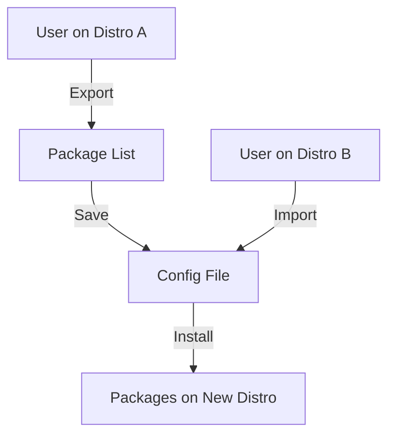
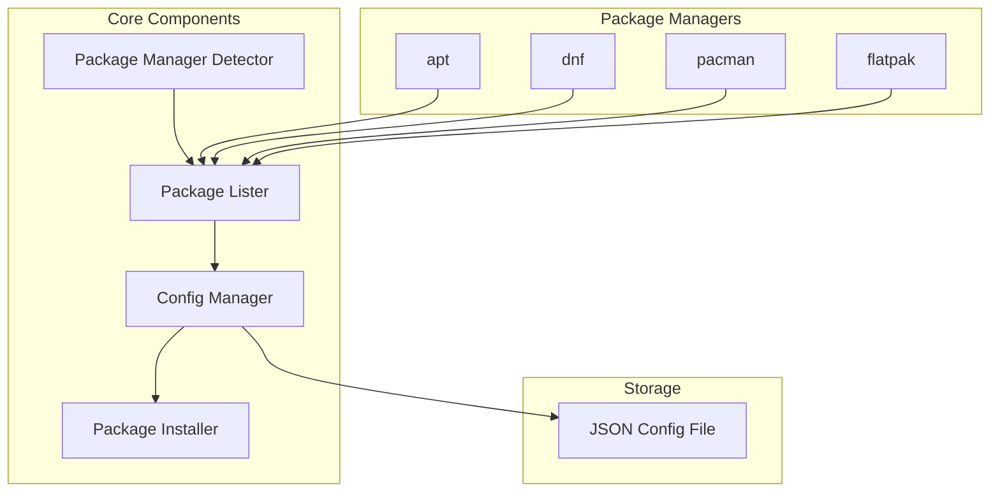
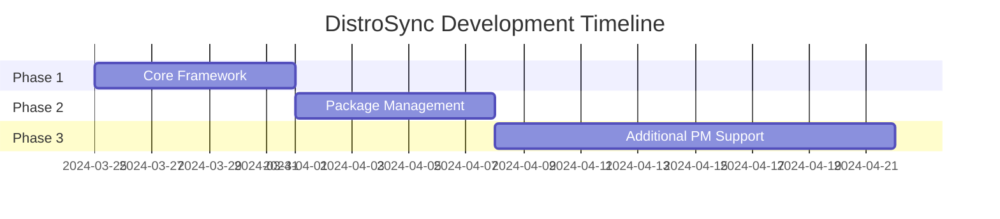

# DistroSync Project Plan

## 1. Project Overview
DistroSync will be a command-line tool that helps Linux users maintain consistency across different distributions by automating package installation.



## 2. Core Features (v1.0)
1. **Export Package List**
   - List installed packages from current system
   - Save to portable configuration file
2. **Import and Install**
   - Read configuration file
   - Map packages to new distro's package manager
   - Install packages automatically

## 3. Technical Architecture



## 4. Implementation Plan

### Phase 1: Core Framework
1. Create basic CLI structure
2. Implement distro detection
3. Create configuration file format

### Phase 2: Package Management
1. Implement package listing for apt-based systems
2. Create package mapping system
3. Implement package installation

### Phase 3: Additional Package Managers
1. Add support for dnf
2. Add support for pacman
3. Add support for flatpak



## 5. Technical Decisions

### Programming Language: Python
- Reasons:
  - Excellent package management libraries
  - Cross-platform compatibility
  - Rich ecosystem for system operations
  - Easy to read and maintain

### Storage Format: JSON
```json
{
  "metadata": {
    "source_distro": "ubuntu",
    "export_date": "2024-03-25"
  },
  "packages": {
    "apt": ["brave-browser", "chrome", "vscode"],
    "flatpak": ["org.signal.Signal"]
  }
}
```

### Command-Line Interface
```bash
# Export packages
distrosync export --output my_packages.json

# Import and install packages
distrosync import --file my_packages.json
```

## 6. Future Expansion Points
1. GUI interface
2. Dotfiles management
3. System settings backup
4. Desktop environment configurations

## 7. Next Steps
1. Set up Python development environment
2. Create project structure
3. Start implementing core framework (Phase 1)
4. Write unit tests for each component
5. Document API and usage instructions