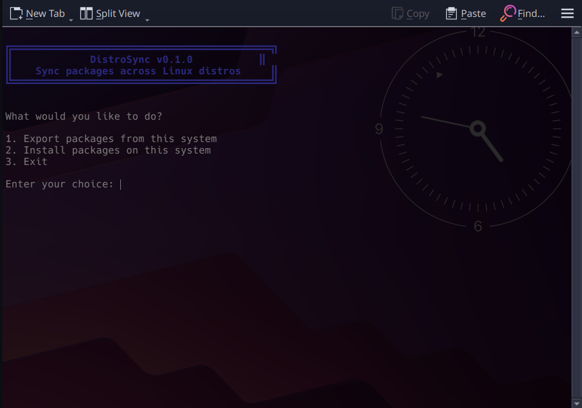
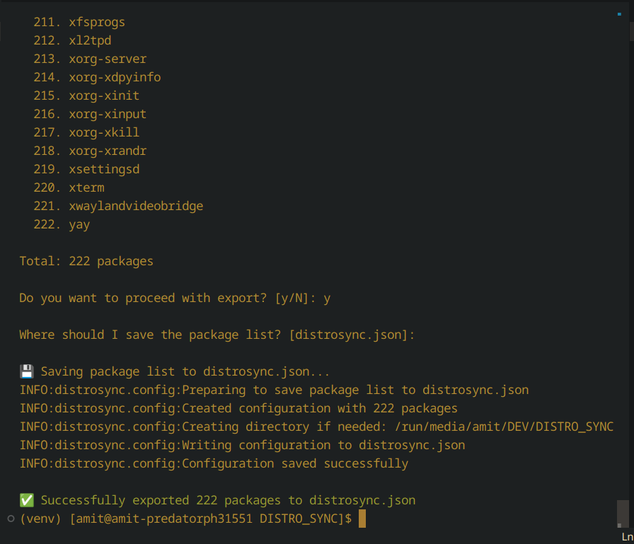
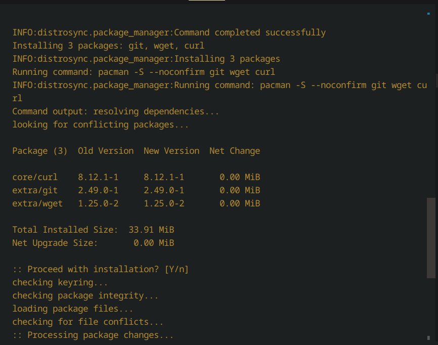
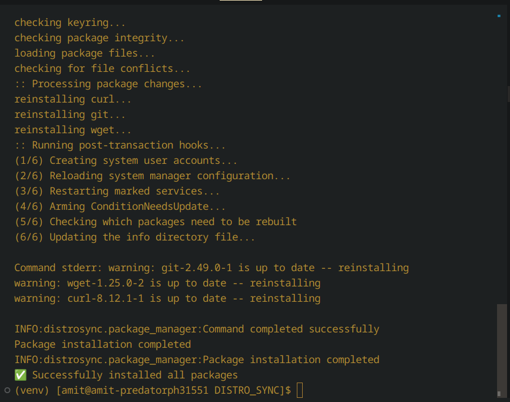

# DistroSync

A tool to sync package installations across Linux distributions. DistroSync helps you maintain consistency when switching between different Linux distributions by automatically exporting and importing your installed packages.

## Features

- Export list of installed packages from your current system
- Import and install packages on your new system
- Support for major package managers:
  - apt (Debian/Ubuntu)
  - dnf (Fedora/RHEL)
  - pacman (Arch/Manjaro/EndeavourOS)
  - zypper (openSUSE)
- User-friendly interface with progress indicators
- Desktop integration (launch from application menu)

## Screenshots

### Desktop Integration

*DistroSync can be launched from your desktop environment*

### Package Export

*Export installed packages with detailed progress*

### Package Installation

*Installing packages with interactive confirmation*

### Installation Complete

*Successful package installation*

## Installation

### Method 1: Desktop Installation (Recommended)

1. Clone the repository:
```bash
git clone https://github.com/yourusername/distrosync.git
cd distrosync
```

2. Run the installation script:
```bash
chmod +x scripts/install.sh
sudo ./scripts/install.sh
```

This will:
- Install DistroSync system-wide
- Create a desktop entry
- Make it available in your application menu

### Method 2: Development Installation

1. Clone the repository:
```bash
git clone https://github.com/yourusername/distrosync.git
cd distrosync
```

2. Create and activate a virtual environment:
```bash
python -m venv venv
source venv/bin/activate
```

3. Install using pip:
```bash
pip install -e .
```

## Usage

### From Application Menu

1. Open your application menu
2. Search for "DistroSync"
3. Click to launch in terminal

### From Terminal

#### Export Packages

To export your currently installed packages:

```bash
distrosync export -o my_packages.json
```

This will create a JSON file containing your package list.

#### Import Packages

To install packages from a saved configuration:

```bash
distrosync install -f my_packages.json
```

This will detect your current distribution and install the packages using the appropriate package manager.

### Debug Mode

To see detailed logging information, use the --debug flag:

```bash
distrosync --debug export -o my_packages.json
```

## Requirements

- Python 3.8 or higher
- Linux operating system
- Root privileges for package installation (sudo)
- One of the supported package managers installed

## Supported Distributions

- Ubuntu/Debian/Pop!_OS (apt)
- Fedora/RHEL/CentOS (dnf)
- Arch Linux/Manjaro/EndeavourOS (pacman)
- openSUSE (zypper)

## Contributing

Contributions are welcome! Please feel free to submit a Pull Request. See [CONTRIBUTING.md](docs/CONTRIBUTING.md) for development guidelines.

## Version History

See [CHANGELOG.md](docs/CHANGELOG.md) for version history and updates.

## License

This project is licensed under the MIT License - see the [LICENSE](LICENSE) file for details.